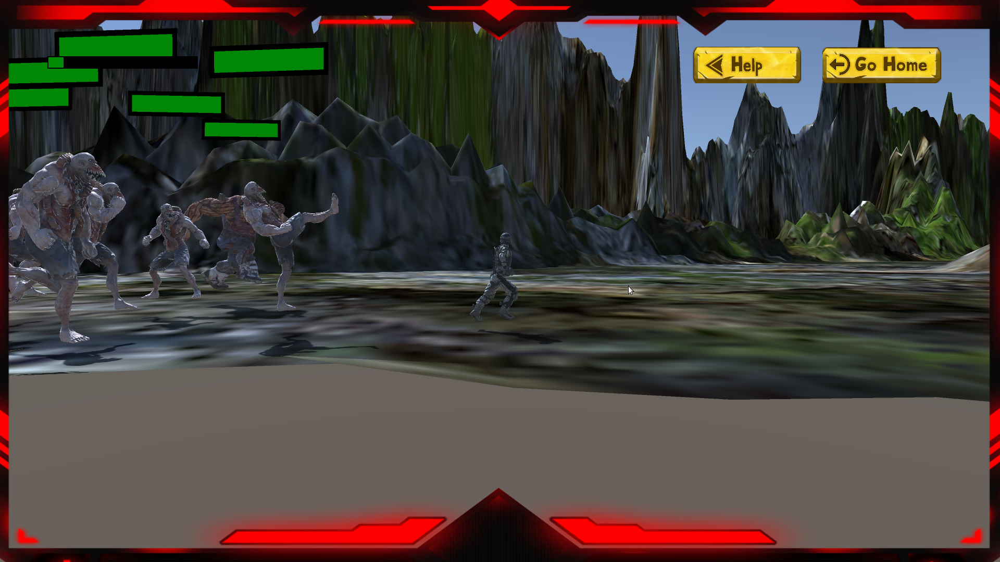

# Soldier survival.

## Guadalajara, Jal. México a 8 de Septiembre del 2022.


Gender: Stealth

Instructions

How to move:
* A,<: You can use this two keys to move left.
* W,↑: To move in front of.
* S,↓: To move in back.
* Shift: To change betwen walk and run.
* Enter: Attack.
* Space: Jump.

## What you need to do
* The game consist in going with the vampire that will show you instructions about what you need to do ton win, that is not neccesary to win, this can helpm you to know the target of the game.


* To countinue you need to find the red flag.


* Try to skipe the enemies so its depends of the kind of the monster its has a speed, damage, live and atraction detection.


* You can renew your live getting the red capsules.


* You can attack your enemies if you want.


* The game ends when the personaje dead.


* The game ends to when you found the red flag.


## Forms of Whin

* Exist only when form to win and is when you come to the red dragon flag.

## Fomrs to lose 
* You lose when the player dead caused by the attacks of the enemies.


# SCRIPS
> _AI_: Control the logic of the enemies, animations, speed and more.


>
To open the live preview you can use the next commandsss

```
Ctrl + Shift + V
```