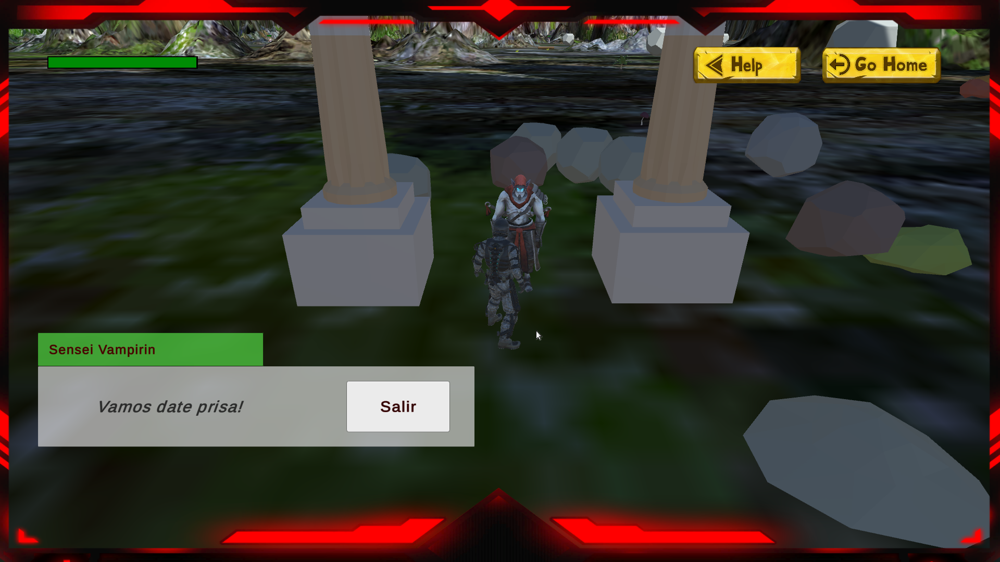
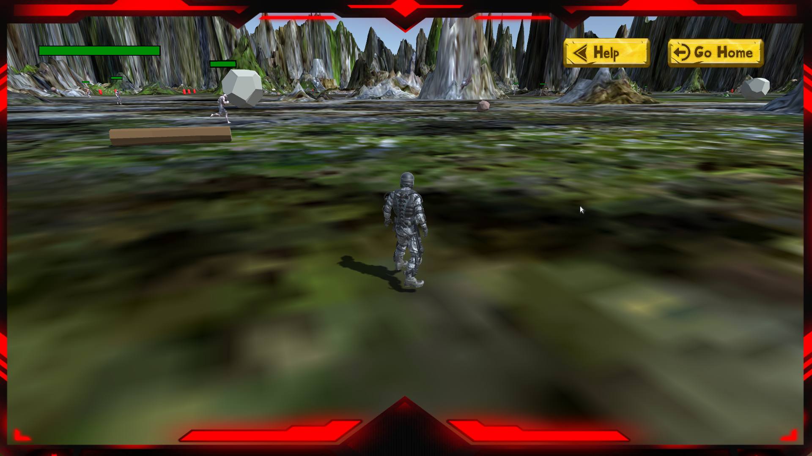
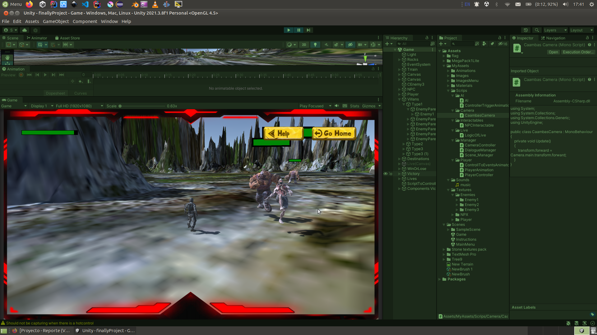
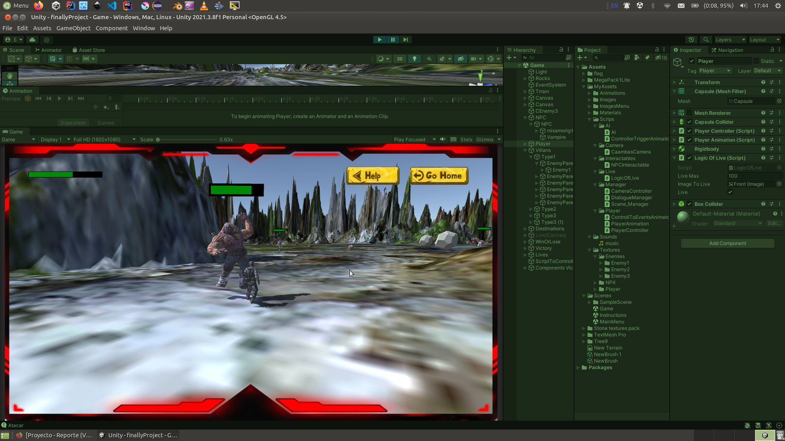

# Soldier survival.

## Guadalajara, Jal. México a 8 de Septiembre del 2022.

Gender: Stealth

Instructions

How to move:
* A,<: You can use this two keys to move left.
* W,↑: To move in front of.
* S,↓: To move in back.
* Shift: To change betwen walk and run.
* Enter: Attack.
* Space: Jump.

## What you need to do
* The game consist in going with the vampire that will show you instructions about what you need to do ton win, that is not neccesary to win, this can helpm you to know the target of the game.

* To countinue you need to find the red flag.

* Try to skipe the enemies so its depends of the kind of the monster its has a speed, damage, live and atraction detection.

* You can renew your live getting the red capsules.

* You can attack your enemies if you want.

* The game ends when the personaje dead.

* The game ends to when you found the red flag.

## Forms of Whin

* Exist only when form to win and is when you come to the red dragon flag.

## Fomrs to lose 
* You lose when the player dead caused by the attacks of the enemies.

# SCRIPS
> _AI_: Control the logic of the enemies, animations, speed and more.

> _ControllerTriggerAnimation_: Control the events in the enemies animations.

> _CaambasCamera_: This show the live var always the front of the camera.

> _NPCInteractable_: This allow the player to interact with the NPC and its messages.

> _LogicOfLive_: This get the logic of the live from the rest of the live to the neccessary operations.

> _CameraController_: Controls the space betwen the camera and the player movement.

> _DialogueManager_: Control the dailoge steps and putting this in the corresponding panels.

> _SceneManager_: This controlls the functions to change betwen the different esccenes.

> _ControllToEventsAnimator_: Desactive the attacking state when the animation ends.

> _PlayerAnimation_: This script control the functions to activate the diferent anomations of the Player.

> _PlayerController_: Controls the logic of the player, animations, speed and more.

> _Music_: Allows that the Music object dont be destructed when the scene change.

To open the live preview you can use the next commandsss

  THANKS FOR YOUR ATTENTION

